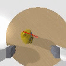
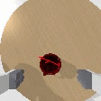

# GA-DDPG

[[website](https://sites.google.com/view/gaddpg), [paper](https://arxiv.org/abs/2010.00824)]


### Installation
```bash
git clone https://github.com/liruiw/GA-DDPG.git --recursive
```

0. Setup: Ubuntu 16.04 or above, CUDA 10.0 or above, python 2.7 / 3.6

1. * (Required for Training) - Install [OMG](https://github.com/liruiw/OMG-Planner) submodule and reuse conda environment.
	* (Docker) See [OMG Docker](https://github.com/liruiw/OMG-Planner#docker-setup) for details.
   * (Demo) - Install GA-DDPG inside a new conda environment
	    ```angular2html
	    conda create --name gaddpg python=3.6.9
	    conda activate gaddpg
	    pip install -r requirements.txt
	    ```
2. Install [PointNet++](https://github.com/liruiw/Pointnet2_PyTorch)

3. Download environment data ```bash experiments/scripts/download_data.sh ```


### Pretrained Model Demo
0. Download pretrained models ```bash experiments/scripts/download_model.sh ```
1. Demo model test ```bash experiments/scripts/test_demo.sh```

Example 1      |  Example 2
:-------------------------:|:-------------------------:
  |  

### Save Data and Offline Training
0. Download example offline data ```bash experiments/scripts/download_offline_data.sh ``` The .npz dataset (saved replay buffer) can be found in ```data/offline_data``` and can be loaded for training.
1. To save extra gpus for online rollouts, use the offline training script ```bash ./experiments/scripts/train_offline.sh bc_aux_dagger.yaml BC```
2. Saving dataset ```bash ./experiments/scripts/train_online_save_buffer.sh bc_save_data.yaml BC```.

### Online Training and Testing
0. We use [ray](https://github.com/ray-project/ray) for parallel rollout and training. The training scripts might require adjustment according to the local machine. See ```config.py``` for some notes.
1. Training online ```bash ./experiments/scripts/train_online_visdom.sh td3_critic_aux_policy_aux.yaml DDPG```. Use visdom and tensorboard to monitor.
2. Testing on YCB objects ```bash ./experiments/scripts/test_ycb.sh demo_model```. Replace demo_model with trained models. Logs and videos would be saved to ```output_misc```


### Note
0. Checkout ```core/test_realworld_ros_final.py``` for an example of real-world usages.
1. Related Works ([OMG](https://github.com/liruiw/OMG-Planner), [ACRONYM](https://github.com/NVlabs/acronym), [6DGraspNet](https://github.com/NVlabs/6dof-graspnet), [6DGraspNet-Pytorch](https://github.com/jsll/pytorch_6dof-graspnet), [ContactGraspNet](https://github.com/NVlabs/contact_graspnet), [Unseen-Clustering](https://github.com/NVlabs/UnseenObjectClustering))
2. To use the full Acronym dataset with Shapenet meshes, please follow [ACRONYM](https://github.com/NVlabs/acronym#using-the-full-acronym-dataset) to download the meshes and grasps and follow [OMG-Planner](https://github.com/liruiw/OMG-Planner#process-new-shapes) to process and save in ```/data```. ```filter_shapenet.json``` can then be used for training.
3. Please use Github issue tracker to report bugs. For other questions please contact [Lirui Wang](mailto:wangliruisz@gmail.com).


### File Structure
```angular2html
├── ...
├── GADDPG
|   |── data 		# training data
|   |   |── grasps 		# grasps from the ACRONYM dataset
|   |   |── objects 		# object meshes, sdf, urdf, etc
|   |   |── robots 		# robot meshes, urdf, etc
|   |   └── gaddpg_scenes	 	# test scenes
|   |── env 		# environment-related code
|   |   |── panda_scene 		# environment and task
|   |   └── panda_gripper_hand_camera 		# franka panda with gripper and camera
|   |── OMG 		# expert planner submodule
|   |── experiments 		# experiment scripts
|   |   |── config 		# hyperparameters for training, testing and environment
|   |   |── scripts 		# main running scripts
|   |   |── model_spec 		# network architecture spec
|   |   |── cfgs 		# experiment config and hyperparameters
|   |   └── object_index 		# object indexes
|   |── core 		# agents and learning
|   |   |──  train_online 		# online training
|   |   |──  train_test_offline 	# testing and offline training
|   |   |──  network 		# network architecture
|   |   |──  test_realworld_ros_final 		# real-world script example
|   |   |──  agent 		# main agent code
|   |   |──  replay_memory 		# replay buffer
|   |   |──  trainer 	# ray-related training setup
|   |   └── ...
|   |── output 		# trained model
|   |── output_misc 	# log and videos
|   └── ...
└── ...
```

### Citation
If you find GA-DDPG useful in your research, please consider citing:
```
@inproceedings{wang2020goal,
	author    = {Lirui Wang, Yu Xiang, Wei Yang, Arsalan Mousavian, and Dieter Fox},
	title     = {Goal-Auxiliary Actor-Critic for 6D Robotic Grasping with Point Clouds},
	booktitle = {arXiv:2010.00824},
	year      = {2020}
}
```

## License
The GA-DDPG is licensed under the [MIT License](LICENSE).
